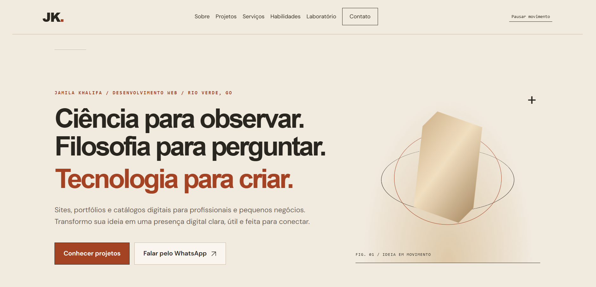
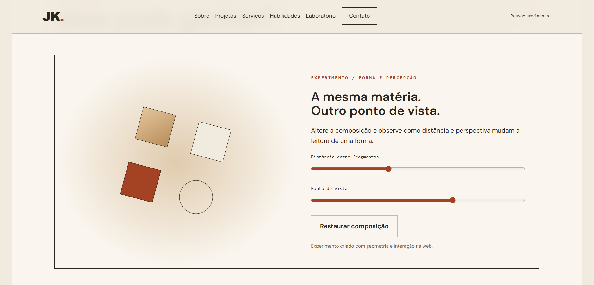
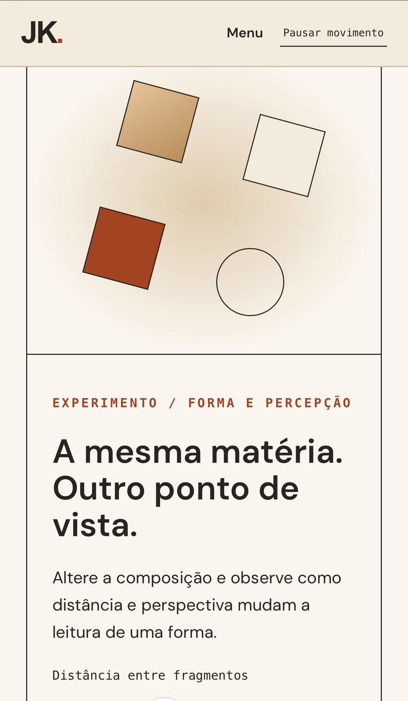

# Portfólio — Jamila Khalifa

Portfólio de desenvolvimento web que reúne projetos, serviços e uma experiência interativa inspirada em ciência, filosofia e geometria.

**[Visitar o portfólio](https://portfolio-jamila-khalifa.netlify.app/)**

## Prévia do projeto

### Computador

**Página inicial**



**Laboratório — forma e percepção**



### Celular

<p>
  
  
</p>

## Proposta

Apresentar meu trabalho como desenvolvedora web e facilitar o primeiro contato com profissionais e pequenos negócios. A identidade visual combina tons de areia, formas geométricas e referências ao brutalismo em uma composição clara e experimental.

Ciência para observar. Filosofia para perguntar. Tecnologia para criar.

## Funcionalidades

- Apresentação profissional e projetos com links para os sites e códigos.
- Seções de serviços, processo de trabalho, tecnologias e perguntas frequentes.
- Retrato flutuante e composição geométrica animada na abertura.
- Elementos geométricos que giram e se deslocam conforme a rolagem.
- Reações ao cursor em dispositivos com mouse, incluindo inclinação das prévias.
- Experimento com controles de distância e rotação de formas.
- Quiz de quatro etapas para elaborar um briefing inicial.
- Envio do briefing pelo WhatsApp com as respostas preenchidas na mensagem.
- Formulário opcional de contato integrado ao Supabase por uma função do Netlify.
- Botão para pausar movimentos e suporte à preferência de reduzir movimento do dispositivo.
- Layout responsivo e ícones vetoriais.

As prévias dos projetos são representações gráficas. Os links permitem consultar os sites publicados.

## Tecnologias

| Tecnologia | Utilização |
| --- | --- |
| HTML | Estrutura, conteúdo e formulários |
| CSS | Identidade visual, responsividade e animações |
| JavaScript | Quiz, experimento, cursor e efeitos de rolagem |
| Netlify Functions | Validação e processamento dos contatos |
| Supabase | Armazenamento dos briefings enviados |
| Netlify | Hospedagem e execução da função de backend |

## Arquivos principais

Os caminhos abaixo são relativos à pasta que contém o `index.html`.

| Caminho | Conteúdo |
| --- | --- |
| `index.html` | Página do portfólio |
| `styles.css` | Estilos e adaptações para diferentes telas |
| `script.js` | Interações, quiz e envio do formulário |
| `assets/` | Foto e arquivos visuais |
| `netlify/functions/lead.js` | Função de recebimento dos briefings |
| `netlify.toml` | Configuração de publicação e funções |
| `backend.sql` | Configuração da tabela de contatos e permissões |
| `BACKEND.md` | Instruções para ativar o formulário |

## Executar localmente

Clone o repositório:

```bash
git clone https://github.com/jalkhalifa/portfolio-jamila-khalifa.git
```

Na pasta que contém o `index.html`, inicie um servidor estático. Com Python instalado:

```bash
python -m http.server 8000
```

Abra `http://localhost:8000`. Outra opção é a extensão Live Server do VS Code.

A navegação, o experimento, o quiz e o link de WhatsApp funcionam sem backend. Um servidor estático local não executa a função do Netlify; o formulário exige essa função disponível.

## Ativar o formulário

1. Execute `backend.sql` em um projeto Supabase.
2. Configure a publicação no Netlify a partir da pasta que contém `netlify.toml`.
3. Cadastre `SUPABASE_URL` e `SUPABASE_SERVICE_ROLE_KEY` nas variáveis de ambiente das funções no Netlify.
4. Faça um novo deploy e teste um envio.
5. Confira o registro na tabela `portfolio_leads` do Supabase.

A chave `service_role` fica exclusivamente no servidor. Ela não deve ser publicada no GitHub nem incluída no JavaScript do navegador.

O formulário envia nome, e-mail, respostas do quiz, indicação inicial e registro de autorização para contato. Os dados são enviados após a submissão do formulário; responder ao quiz não registra um contato no banco.

Não há painel administrativo próprio nem envio automático de e-mails. Os contatos são consultados no painel do Supabase. Consulte `BACKEND.md` para mais detalhes.

## Movimento e interação

Os efeitos de cursor são utilizados em dispositivos com mouse. As formas guiadas pela rolagem também funcionam no celular. O botão de pausa e a preferência de reduzir movimento desativam os efeitos animados.

O resultado do quiz é uma indicação inicial para a conversa, não um orçamento automático.

## Autoria e contato

**Jamila Khalifa** — Desenvolvedora web e graduanda em Ciências Biológicas.

[GitHub](https://github.com/jalkhalifa) · [WhatsApp](https://wa.me/5561995962642) · [Portfólio](https://portfolio-jamila-khalifa.netlify.app/)

